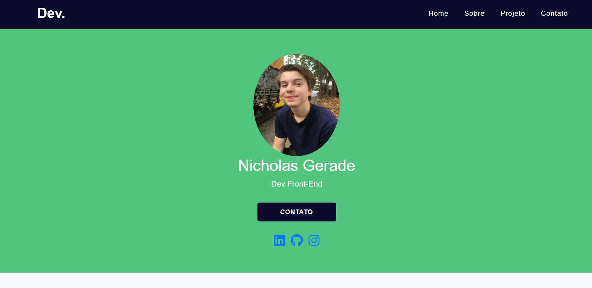

<h1 align="center"> 1° Site de Portfolio Pessoal</h1>

1° Portfolio Pessoal que criei com HTML5, CSS3 e Javascript

---

 

  

---
## 💻 Tecnologias

Esse projeto foi desenvolvido com as seguintes tecnologias:

- HTML5
- CSS3
- Javascript
- Git e Github

---

## 🚧 Projeto

Este projeto foi o primeiro site de Portfólio Pessoal que criei em minha jornada como Front-end, por minha inexperiência o site estava com alguns erros que acabei desistindo de consertar com o tempo, agora que tenho o conhecimento e habilidade suficiente decidi consertar esses erros mas mantendo principalmente o estilo da página que criei logo no começo.
Se você quiser ver o site inicial, com todos os erros, veja neste link: [Site com Erros](https://nicholasgerade.netlify.app/)

Você pode ver o site neste link: [1° - Portfolio Pessoal](https://nigerade.github.io/meu-portfolio/)

--- 
